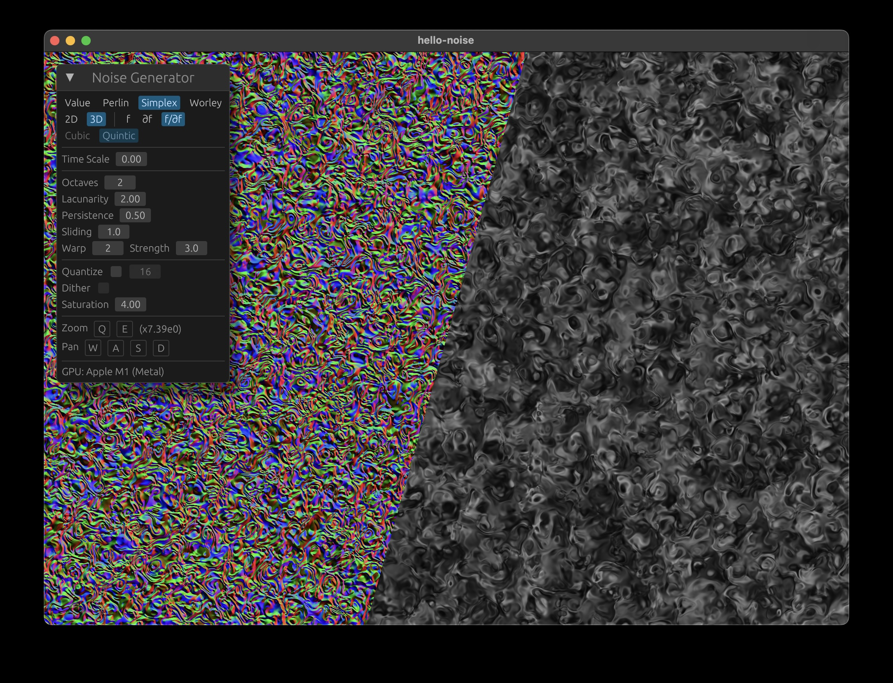

# Noise Generator

Interactive noise generation with Rust/WGPU.

- Noise functions: **Value, Perlin, Simplex, Worley**
- Combinators: **Warping, fBM**
- Implemented dimensions: **2D, 3D** (display time slice)
- **Analytical gradient** implementations for all noise functions and combinators
- XOR and shift based hashing function
- Cubic and quintic easing functions for Value and Perlin Noise
- Realtime editing of noise parameters
- Color control: Quantization and dithering

## References

This project implements algorithms described in the following publications:

- Perlin, K. (1985). _An Image Synthesizer_
- Perlin, K. (2002). _Improving Noise_
- Gustavson, S. (2005). _Simplex Noise Demystified_
- Worley, S. (1996). _A Cellular Texture Basis Function_
- Mandelbrot, B. B., & Van Ness, J. W. (1968). _Fractional Brownian Motions, Fractional Noises and Applications_.
- Musgrave, F. K. (2003). _Texturing and Modeling: A Procedural Approach_
- Appleby, A. (2011). _MurmurHash3_. [Source Code](https://github.com/aappleby/smhasher)
- Quilez, I. (2002). _Warping_. [Article](https://iquilezles.org/articles/warp/)
- Perlin, K., & Hoffert, E. M. (1989). _Hypertexture_
